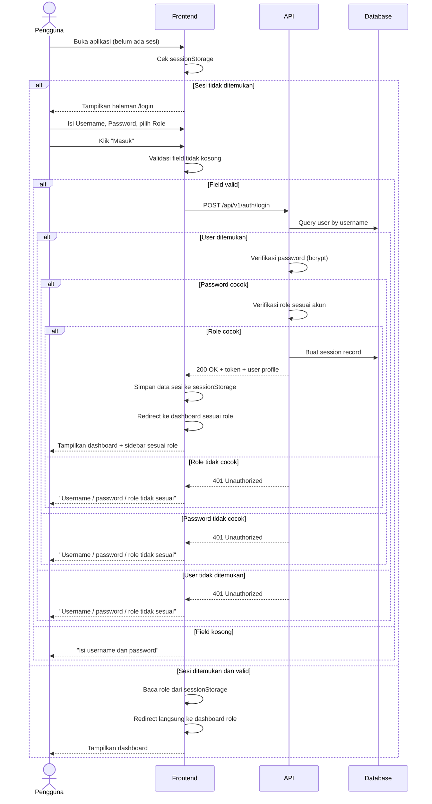
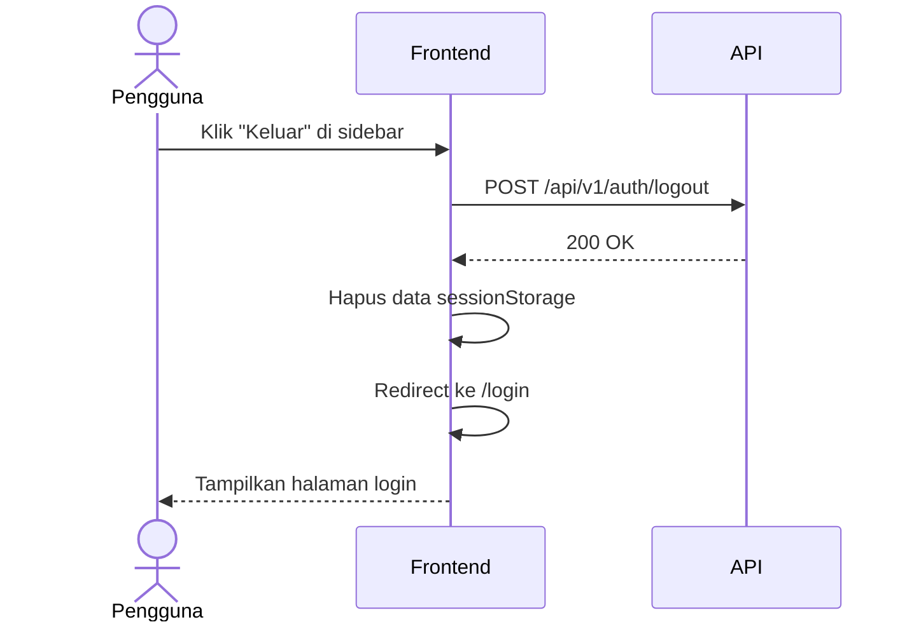

# System Logic: UC-001 Login & Manajemen Sesi

Document Version: v1.0

Use Case ID: UC-001

Use Case Name: Login & Manajemen Sesi

Status: Draft

Last Updated: 2026-06-26

Author: System Analyst AI

---

## 1. Overview

Dokumen ini mendefinisikan system logic untuk proses autentikasi seluruh pengguna (Guru Mapel, Guru Piket, Wali Kelas, Admin), penyimpanan sesi di sisi klien (`sessionStorage`), pengalihan ke dashboard sesuai role, serta proses logout.

---

## 2. Sequence Diagram

### 2.1 Login Baru



### 2.2 Logout



---

## 3. API Contract

### 3.1 POST /api/v1/auth/login

Autentikasi pengguna berdasarkan username, password, dan role, lalu membuat sesi.

**Request Headers:**

| Header | Value |
| --- | --- |
| Content-Type | application/json |

**Request Body:**

```json
{
  "username": "string (required)",
  "password": "string (required)",
  "role": "string (required, enum: guru_mapel|guru_piket|wali_kelas|admin)"
}
```

**Request Example:**

```json
{
  "username": "guru_budi",
  "password": "secret123",
  "role": "guru_mapel"
}
```

**Success Response (200 OK):**

```json
{
  "success": true,
  "data": {
    "token": "eyJhbGciOiJIUzI1NiIs...",
    "user": {
      "id": 12,
      "username": "guru_budi",
      "full_name": "Budi Santoso",
      "role": "guru_mapel",
      "mata_pelajaran": ["Matematika"],
      "kelas_binaan": null
    },
    "expires_in": 28800
  },
  "message": "Login berhasil"
}
```

**Error Response (401 Unauthorized):**

```json
{
  "success": false,
  "data": null,
  "message": "Username / password / role tidak sesuai",
  "errors": []
}
```

**Error Response (400 Bad Request):**

```json
{
  "success": false,
  "data": null,
  "message": "Isi username dan password",
  "errors": [
    {
      "field": "username",
      "message": "Username harus diisi"
    },
    {
      "field": "password",
      "message": "Password harus diisi"
    }
  ]
}
```

---

### 3.2 POST /api/v1/auth/logout

Mengakhiri sesi pengguna aktif.

**Request Headers:**

| Header | Value |
| --- | --- |
| Authorization | Bearer <session_token> |

**Success Response (200 OK):**

```json
{
  "success": true,
  "data": null,
  "message": "Logout berhasil"
}
```

---

### 3.3 GET /api/v1/auth/me

Mengambil informasi pengguna yang sedang login, digunakan untuk validasi sesi saat aplikasi dimuat ulang.

**Request Headers:**

| Header | Value |
| --- | --- |
| Authorization | Bearer <session_token> |

**Success Response (200 OK):**

```json
{
  "success": true,
  "data": {
    "id": 12,
    "username": "guru_budi",
    "full_name": "Budi Santoso",
    "role": "guru_mapel",
    "mata_pelajaran": ["Matematika"],
    "kelas_binaan": null
  },
  "message": "Success"
}
```

**Error Response (401 Unauthorized):**

```json
{
  "success": false,
  "data": null,
  "message": "Sesi tidak valid atau sudah berakhir",
  "errors": []
}
```

---

## 4. Data Flow

| Step | Input | Process | Output |
| --- | --- | --- | --- |
| 1 | Username, Password, Role | Validasi field kosong (client-side) | Input tervalidasi |
| 2 | Input tervalidasi | API memverifikasi kredensial dan role | Token sesi |
| 3 | Token + user profile | Disimpan ke `sessionStorage` | Sesi aktif di browser |
| 4 | Token dari sessionStorage | Disertakan di header Authorization pada setiap request | Request terautentikasi |
| 5 | Aksi "Keluar" | Hapus sessionStorage + invalidasi token di server | Sesi berakhir |

---

## 5. Business Rules

| Rule | Description |
| --- | --- |
| BR-001 | Kombinasi username, password, dan role harus cocok dengan akun terdaftar |
| BR-002 | Role menentukan menu sidebar dan halaman dashboard yang ditampilkan |
| BR-003 | Sesi disimpan di `sessionStorage`, otomatis hilang saat tab/browser ditutup |
| BR-004 | Jika sesi valid ditemukan saat aplikasi dibuka, pengguna langsung diarahkan ke dashboard tanpa melalui form login |
| BR-005 | Password disimpan dan diverifikasi menggunakan hashing (bcrypt) |

---

## 6. Security Rules

| Rule | Description |
| --- | --- |
| Password Hashing | Password disimpan dengan bcrypt, salt rounds >= 12 |
| Token Storage | Token sesi disimpan di `sessionStorage` sisi klien (sesuai desain prototipe) |
| Token Expiry | Sesi berakhir setelah 8 jam atau saat tab/browser ditutup |
| Rate Limiting | Maksimal 5 percobaan login per menit per IP |

---

## 7. Traceability

| User Flow | Requirement | API Endpoints |
| --- | --- | --- |
| userflow_uc_001.md | AC1, AC2, AC3, AC4, AC5 | POST /api/v1/auth/login, POST /api/v1/auth/logout, GET /api/v1/auth/me |
