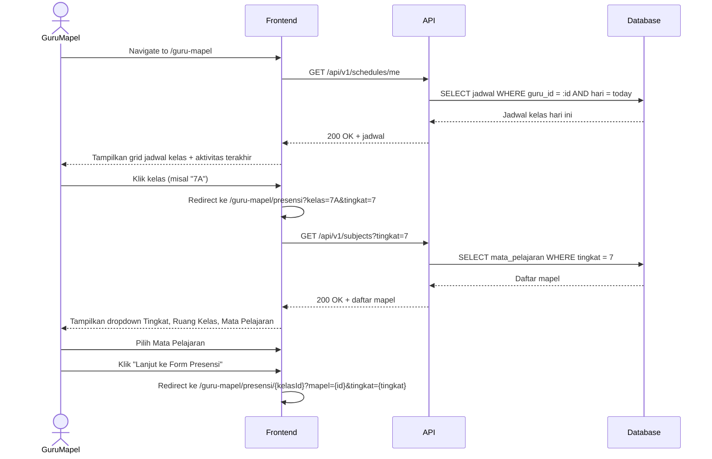
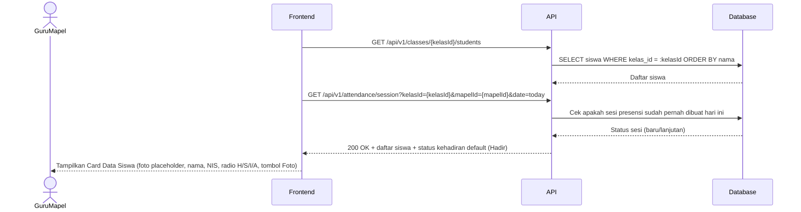
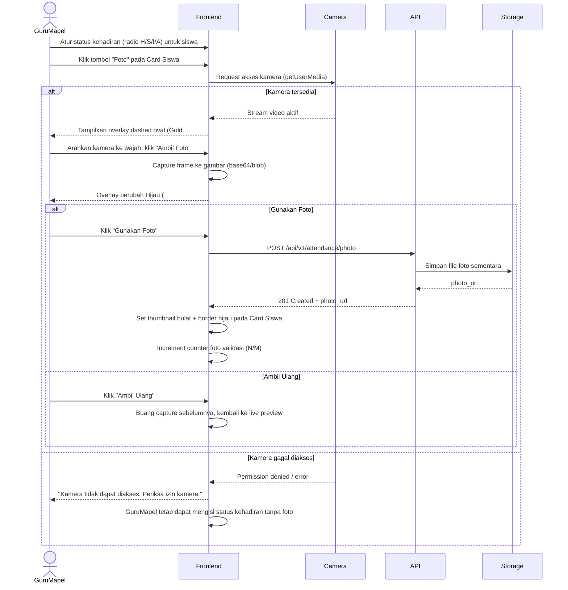
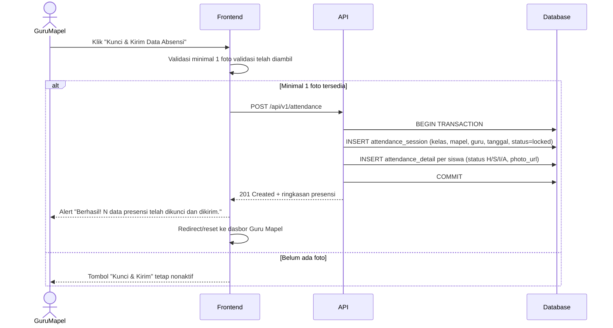

# System Logic: UC-002 Pencatatan Presensi & Validasi Foto

Document Version: v1.0

Use Case ID: UC-002

Use Case Name: Pencatatan Presensi & Validasi Foto

Status: Draft

Last Updated: 2026-07-09

Author: System Analyst AI

---

## 1. Overview

Dokumen ini mendefinisikan system logic untuk alur Guru Mapel dalam mencatat kehadiran siswa, termasuk pemilihan kelas/mapel, pengisian status kehadiran (H/S/I/A), pengambilan foto bukti kehadiran melalui kamera, hingga penguncian dan pengiriman data presensi.

---

## 2. Sequence Diagram

### 2.1 Muat Dasbor & Pilih Kelas



### 2.2 Muat Form Presensi



### 2.3 Ambil Foto Bukti Kehadiran



### 2.4 Kunci & Kirim Data Absensi



---

## 3. API Contract

### 3.1 GET /api/v1/schedules/me

Mengambil jadwal kelas milik Guru Mapel yang sedang login untuk hari ini.

**Success Response (200 OK):**

```json
{
  "success": true,
  "data": {
    "jadwal": [
      {
        "kelas_id": "7A",
        "tingkat": 7,
        "mata_pelajaran": "Matematika",
        "jam_ke": "3-4",
        "status_presensi": "belum_diisi"
      }
    ],
    "aktivitas_terakhir": [
      {
        "kelas_id": "7A",
        "waktu": "2026-07-09T08:15:00Z",
        "jumlah_siswa": 32
      }
    ]
  },
  "message": "Success"
}
```

---

### 3.2 GET /api/v1/classes/{kelasId}/students

Mengambil daftar siswa dalam satu kelas beserta status kehadiran default untuk sesi presensi.

**Success Response (200 OK):**

```json
{
  "success": true,
  "data": {
    "kelas_id": "7A",
    "students": [
      {
        "id": 101,
        "nis": "2026001",
        "nama": "Ahmad Fauzi",
        "foto_profil": null,
        "status_kehadiran": "H",
        "photo_url": null
      }
    ],
    "total": 32
  },
  "message": "Success"
}
```

---

### 3.3 GET /api/v1/attendance/session

Mengecek apakah sesi presensi untuk kombinasi kelas, mapel, dan tanggal tertentu sudah pernah dibuat (mencegah duplikasi kunci).

**Query Parameters:**

| Parameter | Type | Required | Description |
| --- | --- | --- | --- |
| kelasId | string | Yes | ID kelas |
| mapelId | integer | Yes | ID mata pelajaran |
| date | string | No | Format YYYY-MM-DD (default: hari ini) |

**Success Response (200 OK):**

```json
{
  "success": true,
  "data": {
    "exists": false,
    "status": "belum_dikunci"
  },
  "message": "Success"
}
```

---

### 3.4 POST /api/v1/attendance/photo

Mengunggah foto bukti kehadiran untuk satu siswa (dipanggil saat Guru Mapel menekan "Gunakan Foto").

**Request Body:**

```json
{
  "student_id": 101,
  "image_base64": "data:image/jpeg;base64,..."
}
```

**Success Response (201 Created):**

```json
{
  "success": true,
  "data": {
    "student_id": 101,
    "photo_url": "/uploads/attendance/2026-07-09/101.jpg",
    "captured_at": "2026-07-09T08:20:00Z"
  },
  "message": "Foto berhasil disimpan sebagai bukti"
}
```

**Error Response (400 Bad Request):**

```json
{
  "success": false,
  "data": null,
  "message": "Format gambar tidak valid",
  "errors": []
}
```

---

### 3.5 POST /api/v1/attendance

Mengunci dan mengirim seluruh data presensi kelas untuk mata pelajaran dan tanggal tertentu.

**Request Body:**

```json
{
  "kelas_id": "7A",
  "mapel_id": 4,
  "tanggal": "2026-07-09",
  "entries": [
    {
      "student_id": 101,
      "status": "H",
      "photo_url": "/uploads/attendance/2026-07-09/101.jpg"
    },
    {
      "student_id": 102,
      "status": "S",
      "photo_url": null
    }
  ]
}
```

**Success Response (201 Created):**

```json
{
  "success": true,
  "data": {
    "session_id": 5501,
    "kelas_id": "7A",
    "mapel_id": 4,
    "tanggal": "2026-07-09",
    "total_siswa": 32,
    "rekap": {
      "hadir": 28,
      "sakit": 2,
      "izin": 1,
      "alpa": 1
    },
    "locked_at": "2026-07-09T08:25:00Z"
  },
  "message": "Berhasil! 32 data presensi telah dikunci dan dikirim."
}
```

**Error Response (400 Bad Request - Foto Kurang):**

```json
{
  "success": false,
  "data": null,
  "message": "Minimal 1 foto validasi diperlukan sebelum mengunci presensi",
  "errors": []
}
```

**Error Response (409 Conflict - Sudah Dikunci):**

```json
{
  "success": false,
  "data": null,
  "message": "Presensi untuk kelas dan mata pelajaran ini sudah dikunci hari ini",
  "errors": []
}
```

**Error Response (500 Internal Server Error):**

```json
{
  "success": false,
  "data": null,
  "message": "Gagal menyimpan data presensi. Silakan coba lagi.",
  "errors": []
}
```

---

## 4. Business Rules

| Rule | Description |
| --- | --- |
| BR-001 | Status kehadiran default setiap siswa adalah "Hadir" (H) sebelum diubah |
| BR-002 | Tombol "Kunci & Kirim Data Absensi" hanya aktif jika minimal 1 foto validasi telah diambil dalam sesi tersebut |
| BR-003 | Jika kamera tidak dapat diakses, Guru Mapel tetap dapat mengisi status kehadiran tanpa foto, namun tidak dapat mengunci presensi |
| BR-004 | Satu kombinasi kelas + mata pelajaran + tanggal hanya dapat dikunci satu kali |
| BR-005 | Data presensi yang gagal disimpan (error server) tidak menghapus entri yang sudah diisi di form, Guru Mapel dapat mencoba submit ulang |
| BR-006 | Counter foto validasi (N/M) ditampilkan di header form dan diperbarui setiap kali foto berhasil digunakan |

---

## 5. Traceability

| User Flow | Requirement | API Endpoints |
| --- | --- | --- |
| userflow_uc_002.md | AC1, AC2 | GET /api/v1/schedules/me, GET /api/v1/classes/{kelasId}/students |
| userflow_uc_002.md | AC3, AC4, AC7 | POST /api/v1/attendance/photo |
| userflow_uc_002.md | AC5, AC6 | POST /api/v1/attendance |
