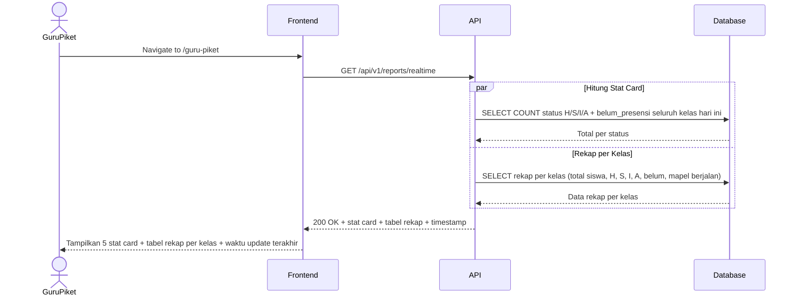
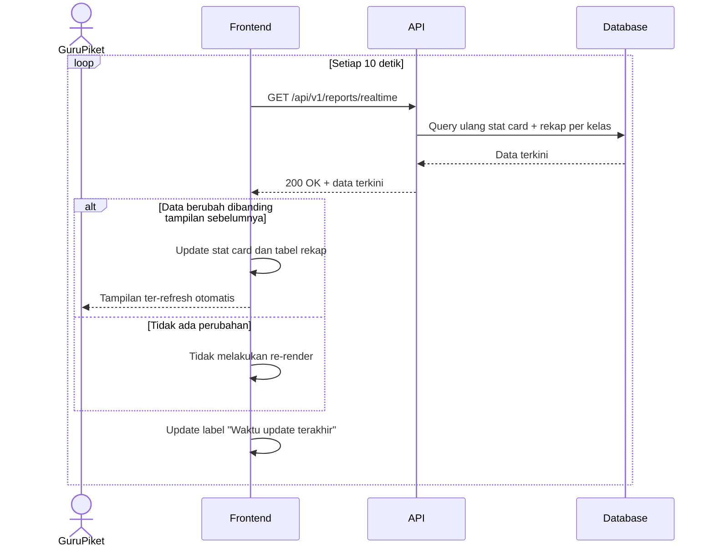
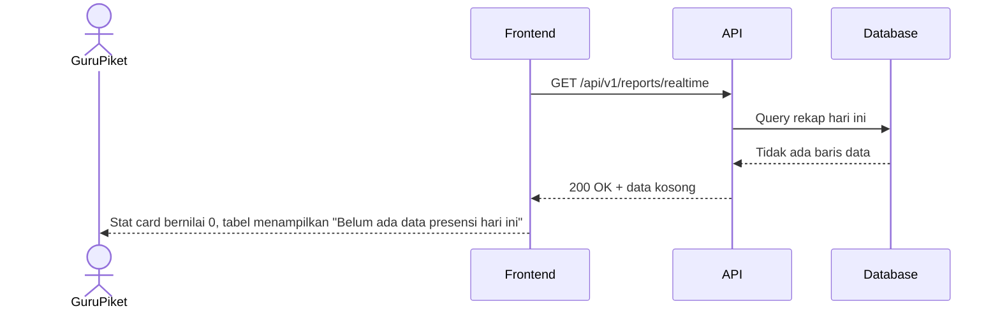

# System Logic: UC-003 Rekapitulasi Otomatis Terpusat

Document Version: v1.0

Use Case ID: UC-003

Use Case Name: Rekapitulasi Otomatis Terpusat

Status: Draft

Last Updated: 2026-07-09

Author: System Analyst AI

---

## 1. Overview

Dokumen ini mendefinisikan system logic untuk halaman monitoring real-time milik Guru Piket, yang menampilkan agregasi kehadiran seluruh kelas dan melakukan auto-refresh data setiap 10 detik.

---

## 2. Sequence Diagram

### 2.1 Muat Halaman Monitoring



### 2.2 Auto-Refresh Berkala



### 2.3 Data Kosong (Belum Ada Presensi)



---

## 3. API Contract

### 3.1 GET /api/v1/reports/realtime

Mengambil agregasi kehadiran seluruh kelas secara real-time untuk hari berjalan.

**Query Parameters:**

| Parameter | Type | Required | Description |
| --- | --- | --- | --- |
| date | string | No | Format YYYY-MM-DD (default: hari ini) |

**Success Response (200 OK):**

```json
{
  "success": true,
  "data": {
    "date": "2026-07-09",
    "stat_card": {
      "hadir": 410,
      "sakit": 12,
      "izin": 8,
      "alpa": 5,
      "belum_presensi": 65
    },
    "rekap_kelas": [
      {
        "kelas_id": "7A",
        "total_siswa": 32,
        "hadir": 28,
        "sakit": 2,
        "izin": 1,
        "alpa": 1,
        "belum": 0,
        "mata_pelajaran": "Matematika"
      },
      {
        "kelas_id": "7B",
        "total_siswa": 30,
        "hadir": 0,
        "sakit": 0,
        "izin": 0,
        "alpa": 0,
        "belum": 30,
        "mata_pelajaran": "-"
      }
    ],
    "last_updated": "2026-07-09T08:30:05Z"
  },
  "message": "Success"
}
```

**Success Response — Data Kosong (200 OK):**

```json
{
  "success": true,
  "data": {
    "date": "2026-07-09",
    "stat_card": {
      "hadir": 0,
      "sakit": 0,
      "izin": 0,
      "alpa": 0,
      "belum_presensi": 500
    },
    "rekap_kelas": [],
    "last_updated": "2026-07-09T07:00:00Z"
  },
  "message": "Belum ada data presensi hari ini"
}
```

---

## 4. Data Aggregation Logic

### 4.1 Stat Card (Total Seluruh Kelas)

```sql
SELECT
    SUM(CASE WHEN status = 'H' THEN 1 ELSE 0 END) as hadir,
    SUM(CASE WHEN status = 'S' THEN 1 ELSE 0 END) as sakit,
    SUM(CASE WHEN status = 'I' THEN 1 ELSE 0 END) as izin,
    SUM(CASE WHEN status = 'A' THEN 1 ELSE 0 END) as alpa,
    (SELECT COUNT(*) FROM student) - COUNT(*) as belum_presensi
FROM attendance_detail ad
JOIN attendance_session ass ON ad.session_id = ass.id
WHERE ass.tanggal = :date AND ass.status = 'locked';
```

### 4.2 Rekap per Kelas

```sql
SELECT
    c.id as kelas_id,
    c.total_siswa,
    SUM(CASE WHEN ad.status = 'H' THEN 1 ELSE 0 END) as hadir,
    SUM(CASE WHEN ad.status = 'S' THEN 1 ELSE 0 END) as sakit,
    SUM(CASE WHEN ad.status = 'I' THEN 1 ELSE 0 END) as izin,
    SUM(CASE WHEN ad.status = 'A' THEN 1 ELSE 0 END) as alpa,
    c.total_siswa - COUNT(ad.id) as belum,
    MAX(mp.nama) as mata_pelajaran
FROM class c
LEFT JOIN attendance_session ass ON ass.kelas_id = c.id AND ass.tanggal = :date AND ass.status = 'locked'
LEFT JOIN attendance_detail ad ON ad.session_id = ass.id
LEFT JOIN mata_pelajaran mp ON mp.id = ass.mapel_id
GROUP BY c.id, c.total_siswa
ORDER BY c.id;
```

---

## 5. Polling & Refresh Logic

| Aspek | Ketentuan |
| --- | --- |
| Interval | Frontend melakukan polling `GET /api/v1/reports/realtime` setiap 10 detik selama halaman `/guru-piket` aktif |
| Re-render | Tabel dan stat card hanya di-render ulang jika payload berbeda dari state sebelumnya, untuk menghindari flicker |
| Timestamp | Field `last_updated` dari response ditampilkan sebagai "Waktu update terakhir" di pojok kanan atas |
| Stop Polling | Polling dihentikan saat pengguna berpindah halaman/route |

---

## 6. Business Rules

| Rule | Description |
| --- | --- |
| BR-001 | Stat card menghitung akumulasi seluruh kelas berdasarkan sesi presensi yang berstatus "locked" |
| BR-002 | Data auto-refresh maksimal setiap 10 detik |
| BR-003 | Jika belum ada sesi presensi yang dikunci pada hari tersebut, seluruh stat card bernilai 0 dan tabel menampilkan pesan empty state |
| BR-004 | Kelas yang belum melaksanakan presensi ditampilkan dengan kolom "Belum" sama dengan total siswa kelas tersebut |

---

## 7. Traceability

| User Flow | Requirement | API Endpoints |
| --- | --- | --- |
| userflow_uc_003.md | AC1, AC2, AC4, AC5 | GET /api/v1/reports/realtime |
| userflow_uc_003.md | AC3 | GET /api/v1/reports/realtime (polling setiap 10 detik) |
