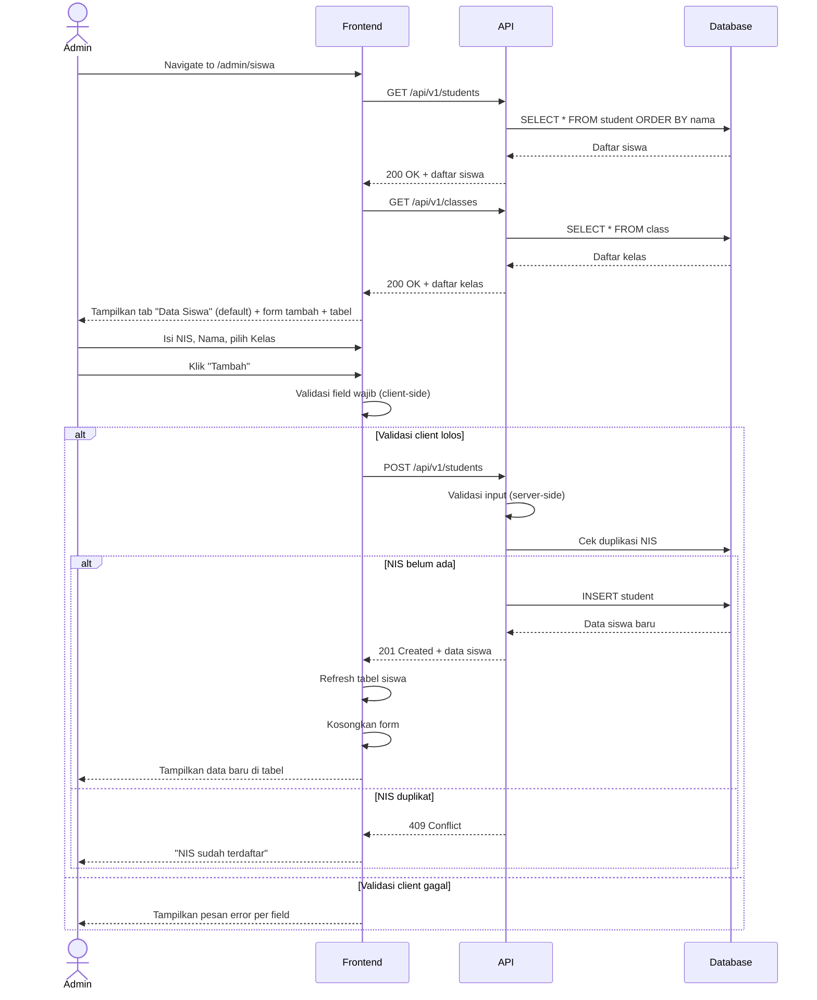
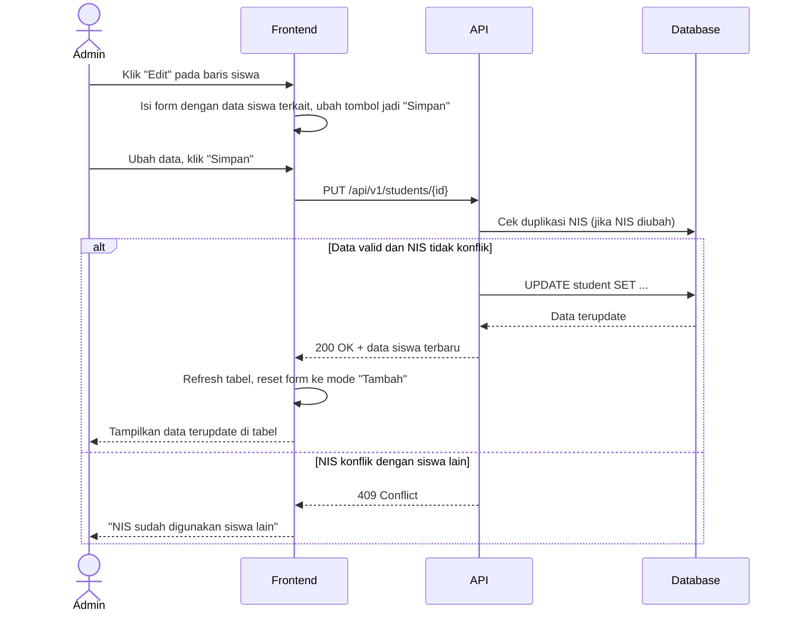
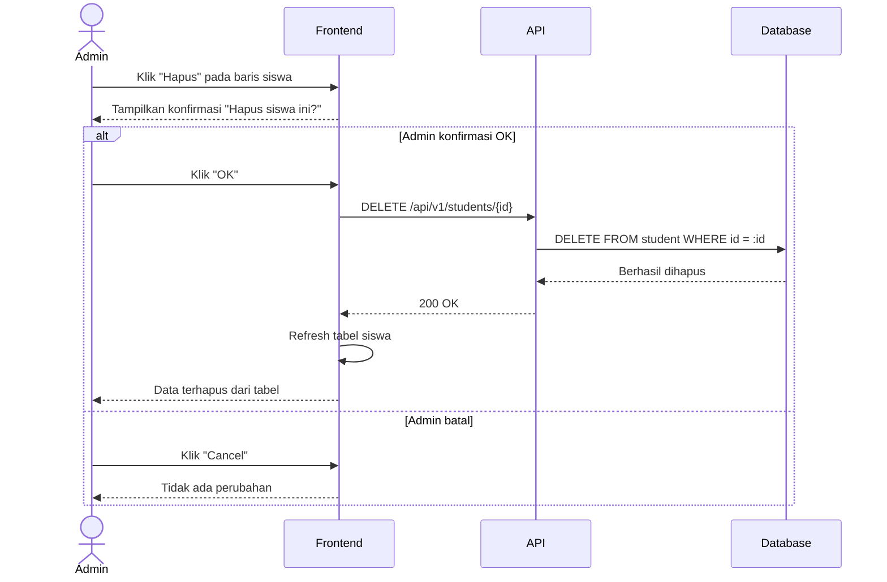
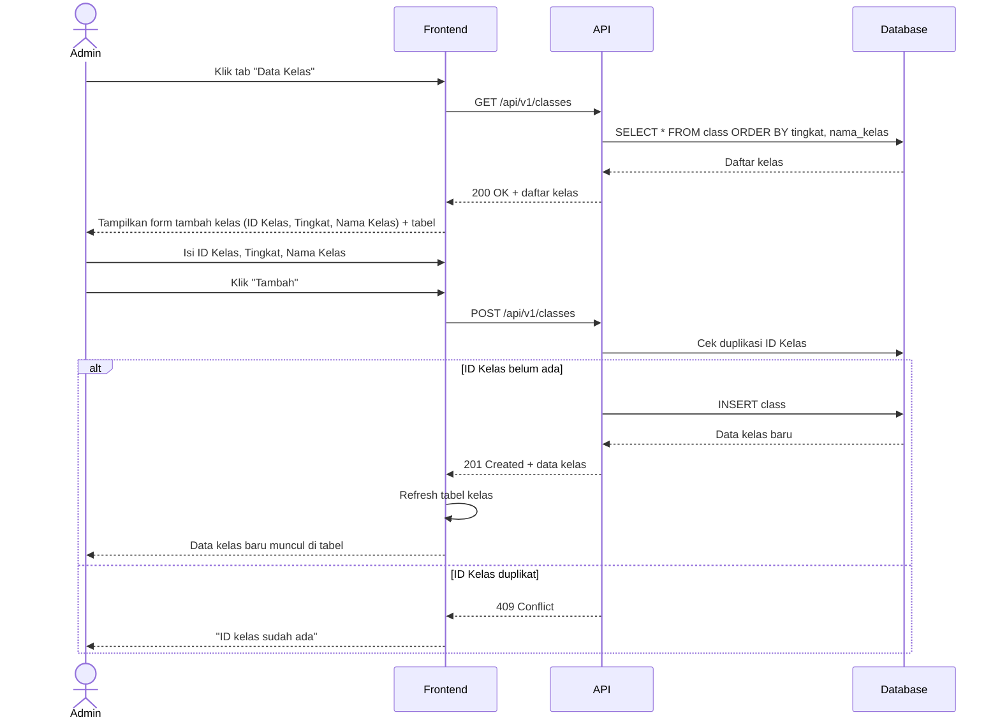

# System Logic: UC-004 Kelola Data Siswa & Kelas

Document Version: v1.0

Use Case ID: UC-004

Use Case Name: Kelola Data Siswa & Kelas

Status: Draft

Last Updated: 2026-07-09

Author: System Analyst AI

---

## 1. Overview

Dokumen ini mendefinisikan system logic untuk pengelolaan data siswa dan data kelas oleh Admin, mencakup operasi tambah, edit, dan hapus (CRUD) pada halaman `/admin/siswa` dengan dua tab: "Data Siswa" dan "Data Kelas".

---

## 2. Sequence Diagram

### 2.1 Muat Halaman & Tambah Siswa



### 2.2 Edit Siswa



### 2.3 Hapus Siswa



### 2.4 Tab Data Kelas (CRUD Kelas)



---

## 3. API Contract

### 3.1 GET /api/v1/students

Mengambil daftar seluruh siswa.

**Query Parameters:**

| Parameter | Type | Required | Description |
| --- | --- | --- | --- |
| search | string | No | Cari berdasarkan nama atau NIS |
| kelas_id | string | No | Filter berdasarkan kelas |
| limit | integer | No | Maksimal hasil (default: 50) |
| offset | integer | No | Offset pagination |

**Success Response (200 OK):**

```json
{
  "success": true,
  "data": {
    "students": [
      {
        "id": 101,
        "nis": "2026001",
        "nama": "Ahmad Fauzi",
        "kelas_id": "7A",
        "created_at": "2026-07-01T00:00:00Z"
      }
    ],
    "total": 500,
    "limit": 50,
    "offset": 0
  },
  "message": "Success"
}
```

---

### 3.2 POST /api/v1/students

Menambahkan data siswa baru.

**Request Body:**

```json
{
  "nis": "string (required, unique)",
  "nama": "string (required)",
  "kelas_id": "string (required)"
}
```

**Success Response (201 Created):**

```json
{
  "success": true,
  "data": {
    "id": 501,
    "nis": "2026500",
    "nama": "Siti Rahma",
    "kelas_id": "7A",
    "created_at": "2026-07-09T09:00:00Z"
  },
  "message": "Data siswa berhasil ditambahkan"
}
```

**Error Response (400 Bad Request):**

```json
{
  "success": false,
  "data": null,
  "message": "Validasi gagal",
  "errors": [
    {
      "field": "nis",
      "message": "NIS harus diisi"
    },
    {
      "field": "kelas_id",
      "message": "Kelas harus dipilih"
    }
  ]
}
```

**Error Response (409 Conflict):**

```json
{
  "success": false,
  "data": null,
  "message": "NIS sudah terdaftar",
  "errors": []
}
```

---

### 3.3 PUT /api/v1/students/{id}

Memperbarui data siswa.

**Request Body:**

```json
{
  "nis": "string (optional, unique)",
  "nama": "string (optional)",
  "kelas_id": "string (optional)"
}
```

**Success Response (200 OK):**

```json
{
  "success": true,
  "data": {
    "id": 101,
    "nis": "2026001",
    "nama": "Ahmad Fauzi Ramadhan",
    "kelas_id": "7B"
  },
  "message": "Data siswa berhasil diperbarui"
}
```

---

### 3.4 DELETE /api/v1/students/{id}

Menghapus data siswa.

**Success Response (200 OK):**

```json
{
  "success": true,
  "data": null,
  "message": "Data siswa berhasil dihapus"
}
```

**Error Response (404 Not Found):**

```json
{
  "success": false,
  "data": null,
  "message": "Siswa tidak ditemukan",
  "errors": []
}
```

---

### 3.5 GET /api/v1/classes

Mengambil daftar seluruh kelas.

**Success Response (200 OK):**

```json
{
  "success": true,
  "data": {
    "classes": [
      {
        "id": "7A",
        "tingkat": 7,
        "nama_kelas": "7A",
        "total_siswa": 32,
        "wali_kelas": "Dewi Anggraini"
      }
    ],
    "total": 18
  },
  "message": "Success"
}
```

---

### 3.6 POST /api/v1/classes

Menambahkan data kelas baru.

**Request Body:**

```json
{
  "id": "string (required, unique)",
  "tingkat": "integer (required)",
  "nama_kelas": "string (required)"
}
```

**Success Response (201 Created):**

```json
{
  "success": true,
  "data": {
    "id": "9C",
    "tingkat": 9,
    "nama_kelas": "9C",
    "total_siswa": 0
  },
  "message": "Data kelas berhasil ditambahkan"
}
```

**Error Response (409 Conflict):**

```json
{
  "success": false,
  "data": null,
  "message": "ID kelas sudah ada",
  "errors": []
}
```

---

### 3.7 PUT /api/v1/classes/{id}

Memperbarui data kelas.

**Request Body:**

```json
{
  "tingkat": "integer (optional)",
  "nama_kelas": "string (optional)"
}
```

**Success Response (200 OK):**

```json
{
  "success": true,
  "data": {
    "id": "9C",
    "tingkat": 9,
    "nama_kelas": "9C Unggulan"
  },
  "message": "Data kelas berhasil diperbarui"
}
```

---

### 3.8 DELETE /api/v1/classes/{id}

Menghapus data kelas.

**Success Response (200 OK):**

```json
{
  "success": true,
  "data": null,
  "message": "Data kelas berhasil dihapus"
}
```

**Error Response (409 Conflict — Masih Ada Siswa):**

```json
{
  "success": false,
  "data": null,
  "message": "Kelas tidak dapat dihapus karena masih memiliki siswa terdaftar",
  "errors": []
}
```

---

## 4. Validation Rules

| Field | Rule | Error Message |
| --- | --- | --- |
| nis | Required, unik | "NIS harus diisi" / "NIS sudah terdaftar" |
| nama (siswa) | Required | "Nama siswa harus diisi" |
| kelas_id (siswa) | Required, harus ada di tabel kelas | "Kelas harus dipilih" |
| id (kelas) | Required, unik | "ID kelas harus diisi" / "ID kelas sudah ada" |
| tingkat | Required, numerik 7-9 | "Tingkat harus diisi" |
| nama_kelas | Required | "Nama kelas harus diisi" |

---

## 5. Business Rules

| Rule | Description |
| --- | --- |
| BR-001 | NIS siswa bersifat unik di seluruh sistem |
| BR-002 | ID Kelas bersifat unik |
| BR-003 | Setiap siswa harus terasosiasi dengan satu kelas yang valid |
| BR-004 | Konfirmasi wajib ditampilkan sebelum penghapusan data siswa atau kelas |
| BR-005 | Kelas yang masih memiliki siswa terdaftar tidak dapat dihapus |
| BR-006 | Tabel selalu menampilkan data terkini setelah operasi tambah/edit/hapus |

---

## 6. Traceability

| User Flow | Requirement | API Endpoints |
| --- | --- | --- |
| userflow_uc_004.md | AC1, AC3, AC4, AC5 | GET/POST/PUT/DELETE /api/v1/students |
| userflow_uc_004.md | AC2, AC3, AC4, AC5 | GET/POST/PUT/DELETE /api/v1/classes |
