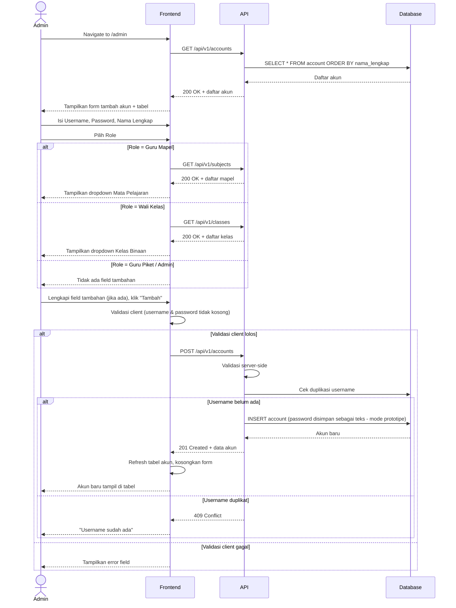
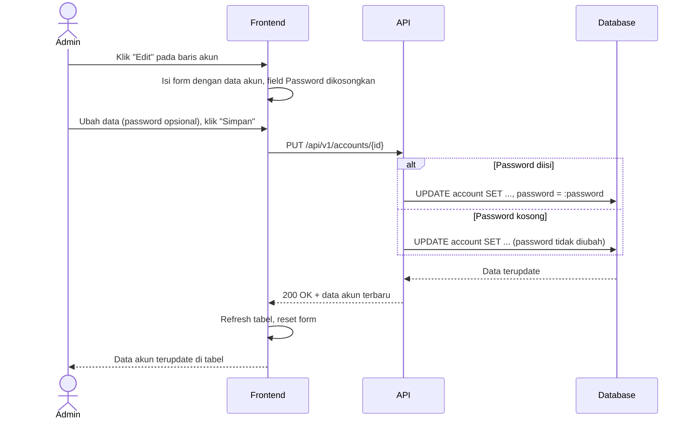
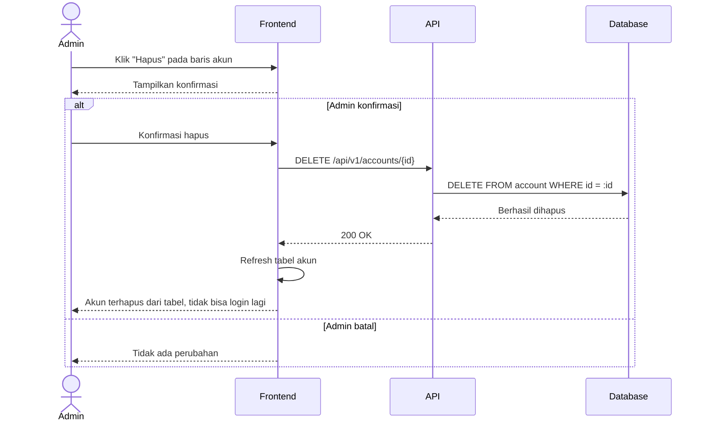
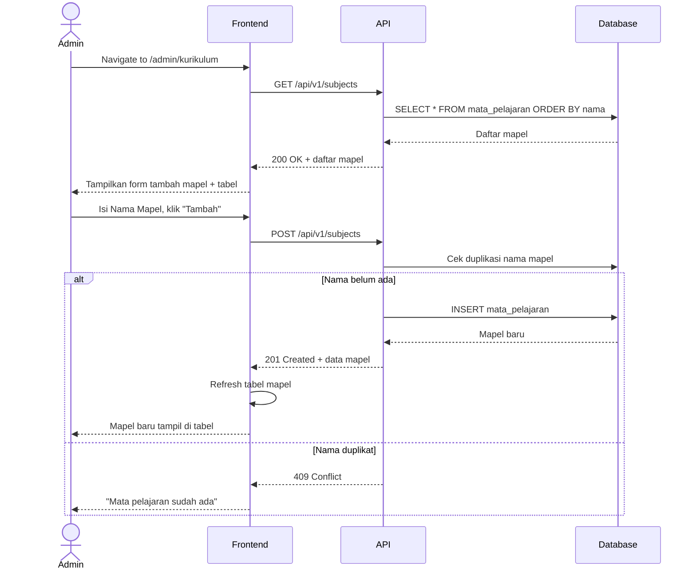

# System Logic: UC-005 Kelola Akun & Mata Pelajaran

Document Version: v1.0

Use Case ID: UC-005

Use Case Name: Kelola Akun & Mata Pelajaran

Status: Draft

Last Updated: 2026-07-09

Author: System Analyst AI

---

## 1. Overview

Dokumen ini mendefinisikan system logic untuk pengelolaan akun pengguna (Admin, Guru Mapel, Guru Piket, Wali Kelas) pada halaman `/admin`, serta pengelolaan mata pelajaran pada halaman `/admin/kurikulum`.

---

## 2. Sequence Diagram

### 2.1 Tambah Akun Pengguna



### 2.2 Edit Akun Pengguna



### 2.3 Hapus Akun Pengguna



### 2.4 Kelola Mata Pelajaran



---

## 3. API Contract

### 3.1 GET /api/v1/accounts

Mengambil daftar seluruh akun pengguna.

**Query Parameters:**

| Parameter | Type | Required | Description |
| --- | --- | --- | --- |
| role | string | No | Filter berdasarkan role |
| search | string | No | Cari berdasarkan username/nama |

**Success Response (200 OK):**

```json
{
  "success": true,
  "data": {
    "accounts": [
      {
        "id": 12,
        "username": "guru_budi",
        "nama_lengkap": "Budi Santoso",
        "role": "guru_mapel",
        "mata_pelajaran": ["Matematika"],
        "kelas_binaan": null,
        "created_at": "2026-06-01T00:00:00Z"
      },
      {
        "id": 20,
        "username": "wali_dewi",
        "nama_lengkap": "Dewi Anggraini",
        "role": "wali_kelas",
        "mata_pelajaran": null,
        "kelas_binaan": "7A",
        "created_at": "2026-06-01T00:00:00Z"
      }
    ],
    "total": 45
  },
  "message": "Success"
}
```

---

### 3.2 POST /api/v1/accounts

Menambahkan akun pengguna baru.

**Request Body:**

```json
{
  "username": "string (required, unique)",
  "password": "string (required)",
  "nama_lengkap": "string (required)",
  "role": "string (required, enum: admin|guru_mapel|guru_piket|wali_kelas)",
  "mata_pelajaran_id": "integer (required jika role = guru_mapel)",
  "kelas_binaan_id": "string (required jika role = wali_kelas)"
}
```

**Request Example:**

```json
{
  "username": "wali_dewi",
  "password": "pass1234",
  "nama_lengkap": "Dewi Anggraini",
  "role": "wali_kelas",
  "kelas_binaan_id": "7A"
}
```

**Success Response (201 Created):**

```json
{
  "success": true,
  "data": {
    "id": 20,
    "username": "wali_dewi",
    "nama_lengkap": "Dewi Anggraini",
    "role": "wali_kelas",
    "kelas_binaan": "7A",
    "created_at": "2026-07-09T09:30:00Z"
  },
  "message": "Akun berhasil ditambahkan"
}
```

**Error Response (400 Bad Request):**

```json
{
  "success": false,
  "data": null,
  "message": "Validasi gagal",
  "errors": [
    {
      "field": "password",
      "message": "Password harus diisi"
    }
  ]
}
```

**Error Response (409 Conflict):**

```json
{
  "success": false,
  "data": null,
  "message": "Username sudah ada",
  "errors": []
}
```

---

### 3.3 PUT /api/v1/accounts/{id}

Memperbarui data akun pengguna. Field `password` bersifat opsional — jika dikosongkan, password lama tetap dipakai.

**Request Body:**

```json
{
  "username": "string (optional, unique)",
  "password": "string (optional)",
  "nama_lengkap": "string (optional)",
  "role": "string (optional)",
  "mata_pelajaran_id": "integer (optional)",
  "kelas_binaan_id": "string (optional)"
}
```

**Success Response (200 OK):**

```json
{
  "success": true,
  "data": {
    "id": 20,
    "username": "wali_dewi",
    "nama_lengkap": "Dewi Anggraini, S.Pd.",
    "role": "wali_kelas",
    "kelas_binaan": "7A"
  },
  "message": "Akun berhasil diperbarui"
}
```

---

### 3.4 DELETE /api/v1/accounts/{id}

Menghapus akun pengguna.

**Success Response (200 OK):**

```json
{
  "success": true,
  "data": null,
  "message": "Akun berhasil dihapus"
}
```

**Error Response (404 Not Found):**

```json
{
  "success": false,
  "data": null,
  "message": "Akun tidak ditemukan",
  "errors": []
}
```

---

### 3.5 GET /api/v1/subjects

Mengambil daftar seluruh mata pelajaran.

**Success Response (200 OK):**

```json
{
  "success": true,
  "data": {
    "subjects": [
      {
        "id": 4,
        "nama": "Matematika",
        "created_at": "2026-06-01T00:00:00Z"
      }
    ],
    "total": 12
  },
  "message": "Success"
}
```

---

### 3.6 POST /api/v1/subjects

Menambahkan mata pelajaran baru.

**Request Body:**

```json
{
  "nama": "string (required, unique)"
}
```

**Success Response (201 Created):**

```json
{
  "success": true,
  "data": {
    "id": 13,
    "nama": "Bahasa Arab",
    "created_at": "2026-07-09T09:40:00Z"
  },
  "message": "Mata pelajaran berhasil ditambahkan"
}
```

**Error Response (409 Conflict):**

```json
{
  "success": false,
  "data": null,
  "message": "Mata pelajaran sudah ada",
  "errors": []
}
```

---

### 3.7 PUT /api/v1/subjects/{id}

Memperbarui nama mata pelajaran.

**Request Body:**

```json
{
  "nama": "string (required)"
}
```

**Success Response (200 OK):**

```json
{
  "success": true,
  "data": {
    "id": 13,
    "nama": "Bahasa Arab Lanjutan"
  },
  "message": "Mata pelajaran berhasil diperbarui"
}
```

---

### 3.8 DELETE /api/v1/subjects/{id}

Menghapus mata pelajaran.

**Success Response (200 OK):**

```json
{
  "success": true,
  "data": null,
  "message": "Mata pelajaran berhasil dihapus"
}
```

**Error Response (409 Conflict — Masih Digunakan):**

```json
{
  "success": false,
  "data": null,
  "message": "Mata pelajaran tidak dapat dihapus karena masih digunakan oleh akun Guru Mapel",
  "errors": []
}
```

---

## 4. Validation Rules

| Field | Rule | Error Message |
| --- | --- | --- |
| username | Required, unik | "Username harus diisi" / "Username sudah ada" |
| password | Required saat tambah akun; opsional saat edit | "Password harus diisi" |
| nama_lengkap | Required | "Nama lengkap harus diisi" |
| role | Required, salah satu dari enum | "Role harus dipilih" |
| mata_pelajaran_id | Required jika role = guru_mapel | "Mata pelajaran harus dipilih" |
| kelas_binaan_id | Required jika role = wali_kelas | "Kelas binaan harus dipilih" |
| nama (mapel) | Required, unik | "Nama mata pelajaran harus diisi" / "Mata pelajaran sudah ada" |

---

## 5. Business Rules

| Rule | Description |
| --- | --- |
| BR-001 | Username bersifat unik di seluruh sistem |
| BR-002 | Field tambahan (Mata Pelajaran / Kelas Binaan) muncul secara dinamis sesuai role yang dipilih |
| BR-003 | Password pada mode edit tidak diubah jika dikosongkan |
| BR-004 | Password disimpan dalam bentuk teks polos sesuai kebutuhan prototipe (bukan untuk produksi) |
| BR-005 | Nama mata pelajaran bersifat unik |
| BR-006 | Mata pelajaran yang masih terasosiasi dengan akun Guru Mapel tidak dapat dihapus |

---

## 6. Traceability

| User Flow | Requirement | API Endpoints |
| --- | --- | --- |
| userflow_uc_005.md | AC1, AC2, AC3 | GET/POST/PUT/DELETE /api/v1/accounts |
| userflow_uc_005.md | AC4 | GET/POST/PUT/DELETE /api/v1/subjects |
