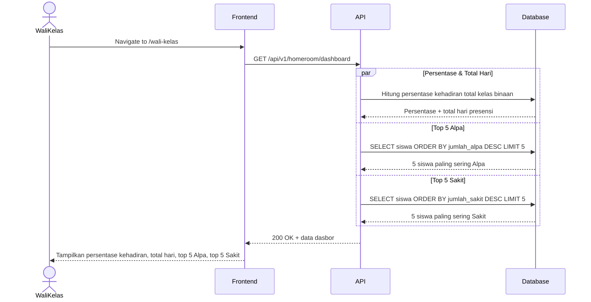
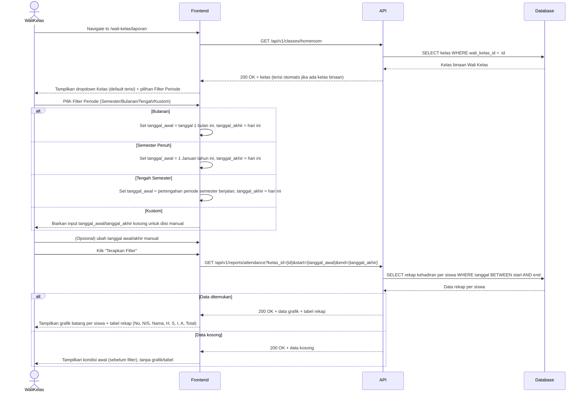
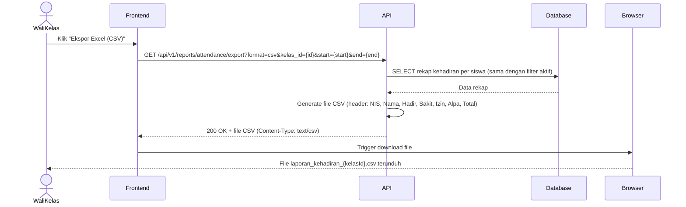
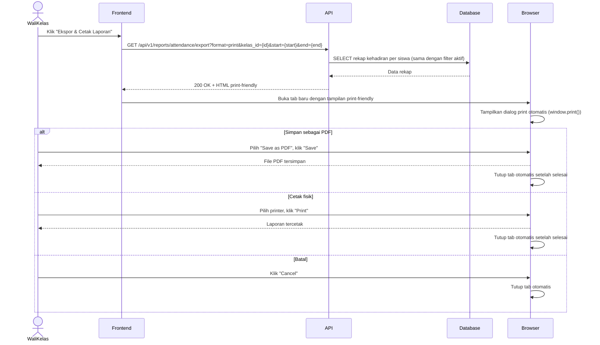

# System Logic: UC-006 Pelaporan & Filter Laporan Akhir

Document Version: v1.0

Use Case ID: UC-006

Use Case Name: Pelaporan & Filter Laporan Akhir

Status: Draft

Last Updated: 2026-06-26

Author: System Analyst AI

---

## 1. Overview

Dokumen ini mendefinisikan system logic untuk halaman Dasbor Kelas Binaan dan Laporan Akademik milik Wali Kelas, mencakup filter periode, grafik batang kehadiran, tabel rekap, serta ekspor laporan ke CSV dan PDF.

---

## 2. Sequence Diagram

### 2.1 Muat Dasbor Kelas Binaan



### 2.2 Muat Halaman Laporan & Terapkan Filter



### 2.3 Ekspor CSV



### 2.4 Ekspor & Cetak PDF



---

## 3. API Contract

### 3.1 GET /api/v1/homeroom/dashboard

Mengambil ringkasan statistik kelas binaan untuk Dasbor Kelas Binaan.

**Success Response (200 OK):**

```json
{
  "success": true,
  "data": {
    "kelas_id": "7A",
    "persentase_kehadiran": 92.5,
    "total_hari_presensi": 120,
    "top_alpa": [
      { "student_id": 108, "nis": "2026008", "nama": "Rizky Ardiansyah", "jumlah_alpa": 6 }
    ],
    "top_sakit": [
      { "student_id": 115, "nis": "2026015", "nama": "Nadia Putri", "jumlah_sakit": 5 }
    ]
  },
  "message": "Success"
}
```

---

### 3.2 GET /api/v1/classes/homeroom

Mengambil kelas binaan milik Wali Kelas yang sedang login.

**Success Response (200 OK):**

```json
{
  "success": true,
  "data": {
    "kelas_binaan": [
      { "id": "7A", "nama_kelas": "7A", "tingkat": 7 }
    ]
  },
  "message": "Success"
}
```

---

### 3.3 GET /api/v1/reports/attendance

Mengambil data grafik dan tabel rekap kehadiran per siswa berdasarkan kelas dan rentang tanggal.

**Query Parameters:**

| Parameter | Type | Required | Description |
| --- | --- | --- | --- |
| kelas_id | string | Yes | ID kelas yang dipilih |
| start | string | Yes | Tanggal awal, format YYYY-MM-DD |
| end | string | Yes | Tanggal akhir, format YYYY-MM-DD |

**Success Response (200 OK):**

```json
{
  "success": true,
  "data": {
    "kelas_id": "7A",
    "periode": {
      "start": "2026-07-01",
      "end": "2026-07-09"
    },
    "chart_data": [
      { "nama": "Ahmad Fauzi", "hadir": 6, "sakit": 0, "izin": 1, "alpa": 0 },
      { "nama": "Siti Rahma", "hadir": 5, "sakit": 1, "izin": 0, "alpa": 1 }
    ],
    "table_data": [
      {
        "no": 1,
        "nis": "2026001",
        "nama": "Ahmad Fauzi",
        "hadir": 6,
        "sakit": 0,
        "izin": 1,
        "alpa": 0,
        "total": 7
      },
      {
        "no": 2,
        "nis": "2026002",
        "nama": "Siti Rahma",
        "hadir": 5,
        "sakit": 1,
        "izin": 0,
        "alpa": 1,
        "total": 7
      }
    ]
  },
  "message": "Success"
}
```

**Success Response — Data Kosong (200 OK):**

```json
{
  "success": true,
  "data": {
    "kelas_id": "7A",
    "periode": {
      "start": "2026-05-01",
      "end": "2026-05-05"
    },
    "chart_data": [],
    "table_data": []
  },
  "message": "Tidak ada data presensi untuk periode yang dipilih"
}
```

**Error Response (400 Bad Request):**

```json
{
  "success": false,
  "data": null,
  "message": "Format tanggal tidak valid atau tanggal akhir sebelum tanggal awal",
  "errors": []
}
```

---

### 3.4 GET /api/v1/reports/attendance/export

Mengekspor laporan kehadiran dalam format CSV atau tampilan print-friendly (untuk PDF).

**Query Parameters:**

| Parameter | Type | Required | Description |
| --- | --- | --- | --- |
| format | string | Yes | `csv` atau `print` |
| kelas_id | string | Yes | ID kelas |
| start | string | Yes | Tanggal awal, format YYYY-MM-DD |
| end | string | Yes | Tanggal akhir, format YYYY-MM-DD |

**Success Response (200 OK) — format=csv:**

```text
Content-Type: text/csv
Content-Disposition: attachment; filename="laporan_kehadiran_7A.csv"

NIS,Nama,Hadir,Sakit,Izin,Alpa,Total
2026001,Ahmad Fauzi,6,0,1,0,7
2026002,Siti Rahma,5,1,0,1,7
```

**Success Response (200 OK) — format=print:**

```json
{
  "success": true,
  "data": {
    "print_html": "<div class='laporan-print'>...</div>"
  },
  "message": "Success"
}
```

**Error Response (404 Not Found):**

```json
{
  "success": false,
  "data": null,
  "message": "Data laporan tidak ditemukan untuk parameter yang diberikan",
  "errors": []
}
```

---

## 4. Data Aggregation Logic

### 4.1 Rekap Kehadiran per Siswa (Tabel & Grafik)

```sql
SELECT
    s.id as student_id,
    s.nis,
    s.nama,
    SUM(CASE WHEN ad.status = 'H' THEN 1 ELSE 0 END) as hadir,
    SUM(CASE WHEN ad.status = 'S' THEN 1 ELSE 0 END) as sakit,
    SUM(CASE WHEN ad.status = 'I' THEN 1 ELSE 0 END) as izin,
    SUM(CASE WHEN ad.status = 'A' THEN 1 ELSE 0 END) as alpa,
    COUNT(ad.id) as total
FROM student s
JOIN attendance_detail ad ON ad.student_id = s.id
JOIN attendance_session ass ON ass.id = ad.session_id
WHERE
    s.kelas_id = :kelas_id
    AND ass.tanggal BETWEEN :start AND :end
    AND ass.status = 'locked'
GROUP BY s.id, s.nis, s.nama
ORDER BY s.nama;
```

### 4.2 Persentase Kehadiran & Total Hari (Dasbor Kelas Binaan)

```sql
SELECT
    ROUND(
      SUM(CASE WHEN ad.status = 'H' THEN 1 ELSE 0 END) * 100.0 / COUNT(ad.id), 1
    ) as persentase_kehadiran,
    COUNT(DISTINCT ass.tanggal) as total_hari_presensi
FROM attendance_detail ad
JOIN attendance_session ass ON ass.id = ad.session_id
JOIN student s ON s.id = ad.student_id
WHERE s.kelas_id = :kelas_id AND ass.status = 'locked';
```

### 4.3 Top 5 Siswa Paling Sering Alpa / Sakit

```sql
SELECT
    s.id as student_id, s.nis, s.nama,
    SUM(CASE WHEN ad.status = 'A' THEN 1 ELSE 0 END) as jumlah_alpa
FROM student s
JOIN attendance_detail ad ON ad.student_id = s.id
JOIN attendance_session ass ON ass.id = ad.session_id
WHERE s.kelas_id = :kelas_id AND ass.status = 'locked'
GROUP BY s.id, s.nis, s.nama
ORDER BY jumlah_alpa DESC
LIMIT 5;
-- Query serupa untuk jumlah_sakit dengan status = 'S'
```

---

## 5. Filter Periode Logic

| Pilihan Filter | Tanggal Awal | Tanggal Akhir |
| --- | --- | --- |
| Bulanan | Tanggal 1 bulan berjalan | Hari ini |
| Semester Penuh | 1 Januari tahun berjalan | Hari ini |
| Tengah Semester | Tanggal pertengahan periode semester berjalan (dikonfigurasi sistem) | Hari ini |
| Kustom | Diisi manual oleh Wali Kelas | Diisi manual oleh Wali Kelas |

Frontend menghitung nilai default tanggal_awal/tanggal_akhir di sisi klien saat opsi filter dipilih, namun tetap dapat diubah manual sebelum menekan "Terapkan Filter". Validasi `tanggal_akhir >= tanggal_awal` dilakukan baik di client maupun server.

---

## 6. Business Rules

| Rule | Description |
| --- | --- |
| BR-001 | Dropdown Kelas terisi otomatis dengan kelas binaan Wali Kelas jika tersedia |
| BR-002 | Data laporan bersifat read-only, tidak dapat diubah oleh Wali Kelas |
| BR-003 | Jika tidak ada data presensi pada rentang filter, sistem menampilkan kondisi awal (sebelum filter diterapkan), bukan tabel/grafik kosong |
| BR-004 | Ekspor CSV dan cetak/PDF menggunakan data yang sama persis dengan filter yang sedang aktif di layar |
| BR-005 | Nama file CSV mengikuti format `laporan_kehadiran_{kelasId}.csv` |
| BR-006 | Tab print-friendly tertutup otomatis setelah proses print/cancel selesai |
| BR-007 | Dasbor Kelas Binaan menghitung top 5 siswa paling sering Alpa dan top 5 paling sering Sakit berdasarkan seluruh riwayat presensi kelas binaan |

---

## 7. Traceability

| User Flow | Requirement | API Endpoints |
| --- | --- | --- |
| userflow_uc_006.md | AC7 | GET /api/v1/homeroom/dashboard |
| userflow_uc_006.md | AC1, AC2, AC3, AC4 | GET /api/v1/classes/homeroom, GET /api/v1/reports/attendance |
| userflow_uc_006.md | AC5 | GET /api/v1/reports/attendance/export?format=csv |
| userflow_uc_006.md | AC6 | GET /api/v1/reports/attendance/export?format=print |
