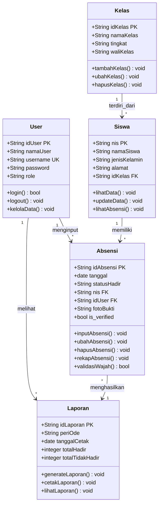

Data Model
Document Version: v1.0
Project: Sistem Absensi MTsN 1 Yogyakarta Product: Web-Based Attendance System 
Status: Draft
Last Updated: 2026-06-25
Author: Kelompok Praktikum DPSI Source: Derived from LAPORAN CLASS DIAGRAM & FASE 1   
Google Dokumen
+ 4

1. Overview
Dokumen ini mendefinisikan model data untuk Sistem Absensi MTsN 1 Yogyakarta. Model data ini dirancang langsung dari struktur Class Diagram tim untuk menyelesaikan masalah error sistem lama, rekap manual via grup WhatsApp, dan kebutuhan laporan rapor.  
Google Dokumen
+ 3

2. Class Diagram

3. Entity Descriptions
3.1 User
Menyimpan data pengguna sistem seperti guru mata pelajaran, guru piket, dan wali kelas.  
Google Dokumen

Attribute	Type	Constraint	Description
idUser	VARCHAR(50)	PRIMARY KEY	
ID unik pengguna  
Google Dokumen
+ 1

namaUser	VARCHAR(100)	NOT NULL	
Nama lengkap pengguna  
Google Dokumen
+ 1

username	VARCHAR(50)	UNIQUE, NOT NULL	
Username login  
Google Dokumen
+ 1

password	VARCHAR(255)	NOT NULL	
Password login (hashed)  
Google Dokumen
+ 1

role	VARCHAR(20)	NOT NULL	
Hak akses: 'guru_mapel', 'guru_piket', 'wali_kelas'  
Google Dokumen
+ 1

3.2 Kelas
Menyimpan data kelas dan relasi tingkatan murid di madrasah.  
Google Dokumen
+ 1

Attribute	Type	Constraint	Description
idKelas	VARCHAR(50)	PRIMARY KEY	
ID unik kelas  
Google Dokumen

namaKelas	VARCHAR(50)	NOT NULL	
Nama ruang kelas (contoh: '9A')  
Google Dokumen

tingkat	VARCHAR(10)	NOT NULL	
Tingkatan kelas ('7', '8', '9')  
Google Dokumen

waliKelas	VARCHAR(100)	NOT NULL	
Nama guru pendamping kelas  
Google Dokumen

3.3 Siswa
Menyimpan informasi identitas siswa yang mengikuti kegiatan belajar mengajar.  
Google Dokumen
+ 1

Attribute	Type	Constraint	Description
nis	VARCHAR(20)	PRIMARY KEY	
Nomor Induk Siswa  
Google Dokumen

namaSiswa	VARCHAR(100)	NOT NULL	
Nama lengkap siswa  
Google Dokumen

jenisKelamin	VARCHAR(10)	NOT NULL	
Jenis kelamin ('L' / 'P')  
Google Dokumen

alamat	TEXT	NOT NULL	
Alamat tempat tinggal  
Google Dokumen

idKelas	VARCHAR(50)	FOREIGN KEY → Kelas.idKelas	
ID penempatan kelas siswa  
Google Dokumen

3.4 Absensi
Mencatat status data kehadiran siswa pada setiap pertemuan.  
Google Dokumen
+ 1

Attribute	Type	Constraint	Description
idAbsensi	VARCHAR(50)	PRIMARY KEY	
ID unik transaksi absensi  
Google Dokumen

tanggal	DATE	NOT NULL	
Tanggal pelaksanaan absensi  
Google Dokumen

status_hadir	VARCHAR(20)	NOT NULL	
Status ('Hadir', 'Izin', 'Sakit', 'Alpa')  
Google Dokumen

nis	VARCHAR(20)	FOREIGN KEY → Siswa.nis	
Referensi ke siswa terkait  
Google Dokumen

idUser	VARCHAR(50)	FOREIGN KEY → User.idUser	
ID Guru penginput data  
Google Dokumen

fotoBukti	VARCHAR(255)	NULLABLE	URL/Path foto wajah untuk validasi (tambahan)
is_verified	BOOLEAN	DEFAULT FALSE	Status keabsahan deteksi wajah (tambahan)
3.5 Laporan
Mengelola dan merangkum rekapitulasi data kehadiran siswa.  
Google Dokumen

Attribute	Type	Constraint	Description
idLaporan	VARCHAR(50)	PRIMARY KEY	
ID dokumen rekap  
Google Dokumen

periOde	VARCHAR(50)	NOT NULL	
Jangka waktu rekap (contoh: 'Juni 2026')  
Google Dokumen

tanggalCetak	DATE	NOT NULL	
Tanggal dokumen dicetak  
Google Dokumen

totalHadir	INT	NOT NULL, DEFAULT 0	
Jumlah kumulatif hadir siswa  
Google Dokumen

totalTidakHadir	INT	NOT NULL, DEFAULT 0	
Jumlah kumulatif absen (S/I/A)  
Google Dokumen

4. Relationships
Relationship  
Google Dokumen
+ 1

Type	Cardinality	Description
User → Absensi	One-to-Many	1:N	
Satu guru dapat menginput banyak data absensi  
Google Dokumen

Siswa → Absensi	One-to-Many	1:N	
Satu siswa memiliki banyak histori data absensi  
Google Dokumen
+ 1

Kelas → Siswa	One-to-Many	1:N	
Satu kelas memiliki/terdiri dari banyak siswa  
Google Dokumen
+ 1

Absensi → Laporan	Many-to-One	N:1	
Banyak data absensi dirangkum untuk menghasilkan laporan  
Google Dokumen

User → Laporan	One-to-Many	1:N	
Pengguna (Wali Kelas/Piket) dapat melihat laporan  
Google Dokumen

5. Business Rules
5.1 Aturan Penginputan & Kamera (Guru Mapel)
Guru Mapel wajib memilih kelas dan mata pelajaran sebelum form absensi terbuka.  
Google Dokumen

Jika status diisi 'Hadir', aplikasi mengaktifkan modul kamera untuk mengambil foto wajah siswa.

Method validasiWajah() akan mengecek kecocokan foto. Jika valid, is_verified berubah menjadi TRUE.

5.2 Aturan Rekapitulasi (Guru Piket & Wali Kelas)
Setelah Guru Mapel menekan inputAbsensi(), data otomatis masuk ke menu rekapAbsensi() Guru Piket.  
Google Dokumen
+ 1

Wali kelas hanya diperbolehkan menggunakan fungsi lihatLaporan() dan cetakLaporan() untuk pelengkap dokumen pembagian rapor.  
Google Dokumen
+ 1

6. Indexes
Table	Index	Columns	Purpose
siswa	idx_siswa_nis	nis	Mempercepat pencarian data murid berdasarkan NIS
absensi	idx_absensi_tanggal	tanggal	Mengoptimalkan pencarian absensi berdasarkan rentang hari
absensi	idx_absensi_siswa	nis	Mempercepat penarikan histori absensi per anak
7. SQL DDL (PostgreSQL)
SQL
CREATE TABLE "user" (
    idUser VARCHAR(50) PRIMARY KEY,
    namaUser VARCHAR(100) NOT NULL,
    username VARCHAR(50) UNIQUE NOT NULL,
    password VARCHAR(255) NOT NULL,
    role VARCHAR(20) NOT NULL
);

CREATE TABLE kelas (
    idKelas VARCHAR(50) PRIMARY KEY,
    namaKelas VARCHAR(50) NOT NULL,
    tingkat VARCHAR(10) NOT NULL,
    waliKelas VARCHAR(100) NOT NULL
);

CREATE TABLE siswa (
    nis VARCHAR(20) PRIMARY KEY,
    namaSiswa VARCHAR(100) NOT NULL,
    jenisKelamin VARCHAR(10) NOT NULL,
    alamat TEXT NOT NULL,
    idKelas VARCHAR(50) NOT NULL REFERENCES kelas(idKelas) ON DELETE RESTRICT
);

CREATE TABLE laporan (
    idLaporan VARCHAR(50) PRIMARY KEY,
    periOde VARCHAR(50) NOT NULL,
    tanggalCetak DATE NOT NULL,
    totalHadir INTEGER NOT NULL DEFAULT 0,
    totalTidakHadir INTEGER NOT NULL DEFAULT 0
);

CREATE TABLE absensi (
    idAbsensi VARCHAR(50) PRIMARY KEY,
    tanggal DATE NOT NULL,
    statusHadir VARCHAR(20) NOT NULL,
    nis VARCHAR(20) NOT NULL REFERENCES siswa(nis) ON DELETE CASCADE,
    idUser VARCHAR(50) NOT NULL REFERENCES "user"(idUser),
    fotoBukti VARCHAR(255),
    is_verified BOOLEAN NOT NULL DEFAULT FALSE
);

CREATE INDEX idx_siswa_nis ON siswa(nis);
CREATE INDEX idx_absensi_tanggal ON absensi(tanggal);
CREATE INDEX idx_absensi_siswa ON absensi(nis);